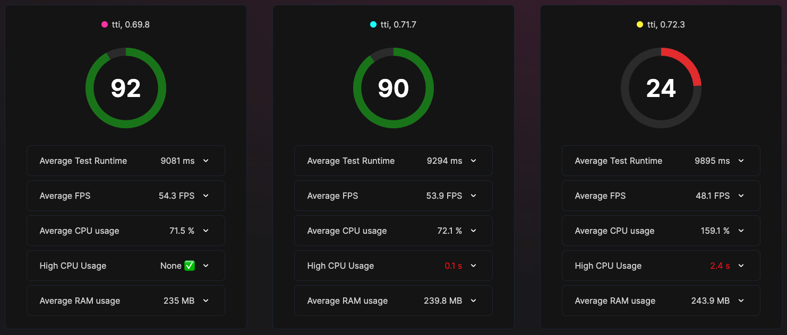
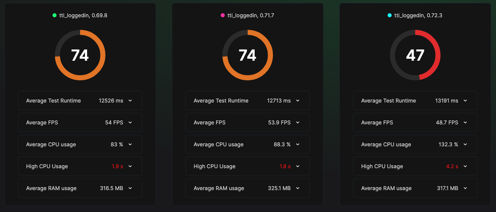
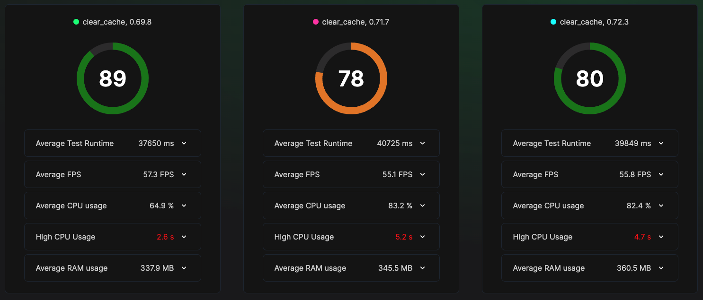

## Overview

This repo is an effort to reproduce what's pointed out by the community at [Very long re-rendering times in 0.71.3](https://github.com/facebook/react-native/issues/36296).
It contains:

- APKs pointing to 0.69.8, 0.71.7, and 0.72.3
- Test files making use of https://flashlight.dev/
- Test results

## APK "sample"

I tried to create a repro using React Native only, but I was not able to reproduce the issue that way. I thought everybody going through the same issue could've been using common libs from the community, such as react-navigation, RNGH, etc.

I know it's not ideal, but I've been running through the issue myself and I'm a maintainer of the [Rocket.Chat app](https://github.com/RocketChat/Rocket.Chat.ReactNative/), which is open source, so everybody can try it by themselves. Hopefully that's good enough.

These are the branches used during those tests:
- [repro-69.8](https://github.com/RocketChat/Rocket.Chat.ReactNative/tree/repro-69.8)
- [repro-71.7](https://github.com/RocketChat/Rocket.Chat.ReactNative/tree/repro-71.7)
- [repro-72.3](https://github.com/RocketChat/Rocket.Chat.ReactNative/tree/repro-72.3)

In case you're interested to test by yourself, here's [how to build it](https://github.com/RocketChat/Rocket.Chat.ReactNative/blob/develop/CONTRIBUTING.md#how-to-run).

## Tests

I created a small script to make it easier to track test results and it can be used like this:

```
sh ./flashlight-runner.sh <testFile> <RN Version>
```

Tests were ran on Xiaomi Redmi 9, Android 11.

All test results and videos are saved on `./results/{test}`.

You can see the results and all the info generated (threads, CPU, videos, etc) by Flashlight by running this command:

```
flashlight report ./results/{test}

Example:
flashlight report ./results/clear_cache
```

### tti.yml

This test just open the app and asserts for a label. 0.72 seems to use a lot more resources to load the app.



<video src="readme_content/tti.mp4">

### tti_loggedin.yml

It does a similar thing, but after logged in.



<video src="readme_content/tti_loggedin.mp4">

### clear_cache.yml

It opens the drawer and clears the app cache, which is a feature to refresh local db. It does several requests to the server and it's an expensive task. Even thought TTI tests above shows us 0.72 is worse than the others, this test shows how 0.72 is an improvement over 0.71.



<video src="readme_content/clear_cache.mp4">